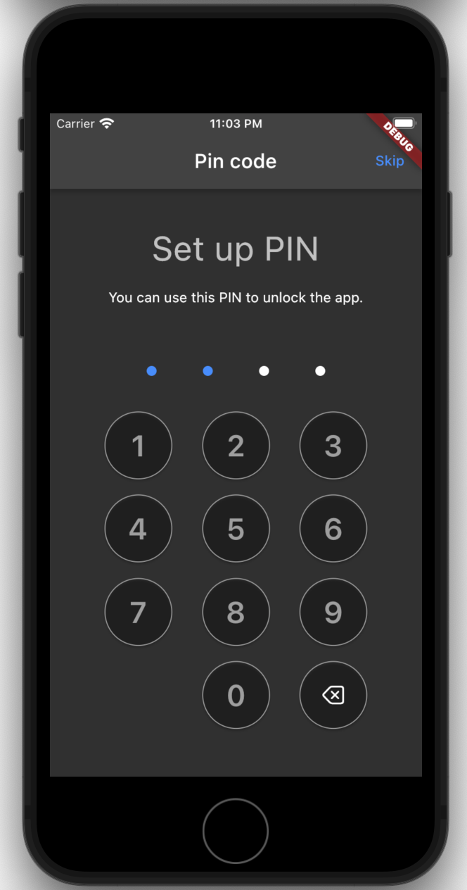

- A Flutter package that helps create a PIN Code screens.

## Usage

```dart
      SafeArea(
        child: Column(
          crossAxisAlignment: CrossAxisAlignment.center,
          children: [
            const SizedBox(height: 40),
            Text(
              'Set up PIN',
              style: Theme.of(context).textTheme.headline4,
            ),
            const SizedBox(height: 20),
            const Text('You can use this PIN to unlock the app.'),
            const SizedBox(height: 60),
            Expanded(
              child: PinCodeWidget(
                onFullPin: (_, __) {},
                initialPinLength: 4,
                onChangedPin: (_) {},
              ),
            ),
          ],
        ),
      ),
```

Full example is here https://github.com/AgoraDesk-LocalMonero/flutter-pin-code-widget/blob/main/example/lib/main.dart

## Showcase

